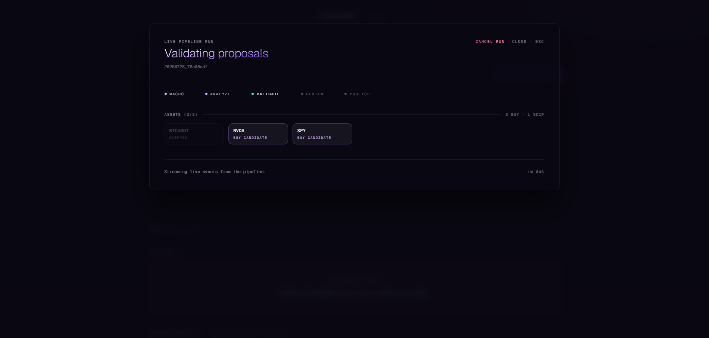

# The Tenth Floor

> Personal multi-asset swing-trade research system. Not a product, not a
> service — a forward-testing experiment to see whether an LLM pipeline
> has actual edge. The experiment was stopped after about a week of live
> running in April 2026; see [Results](#results).

Three specialist LLM agents (MacroAnalyst, TradeAnalyst, RiskReviewer)
analyse 20 assets daily across crypto, US equities, ETFs, and
commodities. Python computes indicators and validates the LLM's chosen
entry/stop/target for sanity. Runs are triggered manually from a React
dashboard — no cron, no scheduler. A run that publishes signals posts
them to Discord and Notion if those credentials are configured in
`.env`, and does nothing if they aren't. Approved signals are tracked to
resolution so expectancy in R units can be measured from real outcomes
rather than a backtest.

The design was originally scoped as a 12-month forward test with
pre-committed decision gates — see [plan.md](plan.md). It never got
close to that horizon.

<!-- Screenshot: drop the PNG at assets/dashboard-track-record.png and
     uncomment. Track Record view — KPI row, today's signals, equity curve.

-->

---

## Results

The experiment is stopped. It ran live for roughly one week in April
2026 and was never resumed.

Approximately five or six signals reached resolution in that window.
None were profitable; a couple came close to target before reversing.
Exact figures are not recoverable — the SQLite signal database was
git-ignored and lived on a Linux install that has since been wiped, and
the Notion journal has no surviving entries. Every number here is
approximate and reconstructed from memory, which is precisely the
failure mode the tracking was meant to prevent.

**What this does not show.** Five or six resolved signals is far too
small a sample to say anything about edge in either direction. The plan
pre-committed to a decision gate at N ≥ 50 resolved trades and a
null-hypothesis test at N ≥ 80 ([plan.md](plan.md)); the run ended an
order of magnitude short of the first one. A losing streak that short is
unremarkable under a positive-expectancy process and equally
unremarkable under a negative one. The honest summary is that the
experiment produced no evidence — not that the pipeline was shown to
have none.

**Model constraint.** All inference ran locally on a consumer GPU with
Qwen3-32B-AWQ. Nothing here transfers to what a frontier model would do
with the same prompts and context.

**What I'd do differently**

1. **Build the offline replay harness first.** There is no way to
   re-score a prompt change against past data: V3's deterministic
   backtester was deleted along with the mechanical gates, and the
   AI-first pipeline can only be evaluated by running it live and
   waiting. Caching `PairSnapshot`s and replaying prompt variants
   against known outcomes would have made an iteration cost minutes
   instead of weeks.
2. **Separate the publishing cap from the measurement sample.** The
   signal cap (a handful per day, max 1 per sector across 20 assets) is
   a reasonable publishing rule and a poor evidence-collection rule.
   Runner-up BUYs are already persisted as `tier='SESSION'`, but
   `check_outcomes` only resolves `tier='PUBLISHED'`
   (`SignalLogger.get_active_signals`). Tracking them too would have
   multiplied the resolved-trade count at zero extra inference cost.
3. **Treat the signal DB as an experimental artifact, not runtime
   state.** Git-ignoring `data/playbook_history.db` was right for the
   repo and wrong for the experiment. A periodic export of resolved
   signals to a committed CSV would have preserved the only results this
   project ever produced.

---

## Pipeline

```
Data (ccxt / yfinance) ──→ TACalculator ──→ Indicators + Structural Levels
                                                    ↓
MacroAnalyst (1 LLM call) ──→ macro frame (regime, per-class impact)
                                                    ↓
Pre-screen (data quality only) ──→ up to 20 candidates
                                                    ↓
TradeAnalyst (1 LLM call per candidate) ──→ BUY proposals with entry/SL/TP
                                                    ↓
Python validation (sanity checks) ──→ valid proposals
                                                    ↓
RiskReviewer (1 LLM call per proposal) ──→ approved signals + conviction
                                                    ↓
Signal cap (2–5 / run, per profile) ──→ SignalLogger + dashboard
```

**Hard constraints:** spot only · LONG only · no leverage · no futures ·
R:R ≥ 1.5 (business integrity floor) · 1d timeframe across all asset
classes.

---

## Quick Start

### Requirements

- Python 3.12+
- Node 20+ (for the dashboard)
- An OpenAI-compatible inference endpoint. The setup this was built
  around is [vLLM](https://docs.vllm.ai/) serving Qwen3-32B-AWQ locally,
  which wants ≥ 24 GB VRAM (RTX 3090 with AWQ) or ≥ 32 GB (RTX 5090) —
  but any OpenAI-compatible server works, local GPU or not. See
  [Pointing it at a model](#run-the-dashboard).
- A [Langfuse](https://langfuse.com) account for LLM tracing (free tier)

### Install

```bash
git clone https://github.com/josanchdev/tenth-floor.git
cd tenth-floor

python -m venv .venv         # dashboard.sh and run.sh both expect ./.venv
.venv/bin/pip install -e ".[dev]"

cd dashboard && pnpm install && cd ..   # npm works too; the lockfile is pnpm's

cp .env.example .env         # fill in LANGFUSE_* keys
```

### Run the dashboard

```bash
./dashboard.sh              # starts FastAPI (8765) + Vite (5173)
```

Open <http://localhost:5173>, then click **Run pipeline**. Events stream
live; approved signals land in `data/playbook_history.db` (git-ignored,
created on first run from [db/schema.sql](db/schema.sql)) and surface in
the Track Record view.

**Pointing it at a model.** The Run button unlocks once an
OpenAI-compatible server answers at `LLM_BASE_URL` (default
`http://localhost:8000/v1`) — the status pill probes `/v1/models` on a
timer and does not care who started the server. Two paths:

- *Managed vLLM* — the pill's start button spawns `vllm serve` from a
  separate virtualenv at `./.vllmenv`, which you have to create
  yourself (`python -m venv .vllmenv && .vllmenv/bin/pip install vllm`).
  This is the path that wants the GPU listed above.
- *Anything else* — set `LLM_BASE_URL` in `.env` to Ollama
  (`http://localhost:11434/v1`), a remote vLLM, or any hosted
  OpenAI-compatible endpoint, and skip the local GPU entirely. Signal
  quality will differ from the Qwen3-32B setup this was built around,
  but the pipeline itself is provider-agnostic.

<!-- Screenshot: drop the PNG at assets/dashboard-runner.png and uncomment.
     Runner modal — phase rail + per-asset cards streaming over the WebSocket.

-->

### CLI alternatives

```bash
./run.sh --local              # headless local pipeline (inference server must be up)
./run.sh --outcomes-only      # resolve OPEN signals only
./run.sh --reset-db           # wipe + recreate the signal DB from schema.sql
pytest                        # all tests (mocked, no network)
```

### Environment

| Variable | Required | Description |
|---|---|---|
| `LANGFUSE_PUBLIC_KEY`  | yes | Langfuse project key |
| `LANGFUSE_SECRET_KEY`  | yes | Langfuse project secret |
| `LANGFUSE_HOST`        | no  | Self-hosted Langfuse URL (default: cloud) |
| `LLM_BASE_URL`         | no  | Override inference server URL (default: `http://localhost:8000/v1`) |
| `VLLM_MODEL`           | no  | Model id for the dashboard LLM launcher |
| `VLLM_PORT`            | no  | vLLM port (default 8000) |
| `DISCORD_WEBHOOK_URL`  | no  | If set, published signals are posted to Discord |
| `NOTION_INTEGRATION_TOKEN` / `NOTION_SIGNAL_DATABASE_ID` | no | If set, each published signal is journaled to Notion |

See [.env.example](.env.example) for the full list and hardware profile
variants in [.env.3090](.env.3090) / [.env.5090](.env.5090).

---

## Repository Layout

```
tenth-floor/
├── config/
│   ├── universe.json           # 20-asset universe + sector mapping
│   ├── risk_profile.json       # Conviction tiers, R:R floor, max signals
│   ├── models.yaml             # LLM provider + per-agent config
│   ├── services.yaml           # External service configuration
│   └── profiles/               # validation / production overlays
├── db/
│   ├── schema.sql              # SQLite DDL (version-controlled)
│   └── migrations/             # Forward-only schema migrations
├── docs/
│   ├── architecture.md         # System design
│   └── signals.md              # Signal output specification
├── src/tenth_floor/
│   ├── main.py                 # Pipeline orchestrator
│   ├── check_outcomes.py       # TP/SL resolution against real candles
│   ├── events.py               # In-process event bus (feeds the dashboard WS)
│   ├── config.py               # Central path resolver
│   ├── universe.py             # Universe loader + asset queries
│   ├── validation.py           # Python sanity checks on LLM output
│   ├── data/                   # ccxt / yfinance / sentiment / typed models
│   ├── features/               # TA indicators + PairSnapshot assembly
│   ├── agents/                 # MacroAnalyst, TradeAnalyst, RiskReviewer
│   ├── notifications/          # Discord + Notion publishing (opt-in via .env)
│   ├── db/signal_logger.py     # SQLite signal persistence
│   └── api/                    # FastAPI backend (signals, runs, llm, ws)
├── dashboard/                  # Vite + React 19 + Tailwind v4 frontend
├── tests/                      # Unit + integration tests (all mocked)
├── plan.md                     # Original 365-day experiment plan (historical)
├── ROADMAP.md                  # V4 architecture history
├── run.sh                      # CLI helper (local / outcomes / reset-db)
├── dashboard.sh                # Dev launcher: uvicorn + Vite
└── docker-compose.yml          # vllm + api + dashboard + pipeline stack
```

---

## Design Principles

1. **AI-first, Python validates.** The LLM decides BUY/SKIP and picks
   entry/SL/TP. Python computes indicators as context and validates the
   output for sanity — never overrides LLM judgement with mechanical
   rules.
2. **Minimal prompts.** Role + output format only. No prescriptive
   trading checklists, no fixed confluence lists. The LLM reasons freely.
3. **Dashboard-only trigger.** Runs happen when I click a button. No
   cron, no scheduler.
4. **Glass box.** Every signal carries full LLM reasoning; every call
   is traced in Langfuse.
5. **Forward testing, not backtesting.** Cleaner data, no overfitting
   risk. The metric that matters is expectancy in R, measured from
   resolved outcomes — which also means it takes a long time to collect
   enough of them to say anything (see [Results](#results)).

---

## License

MIT — see [LICENSE](LICENSE). Personal research code. Not financial
advice.
