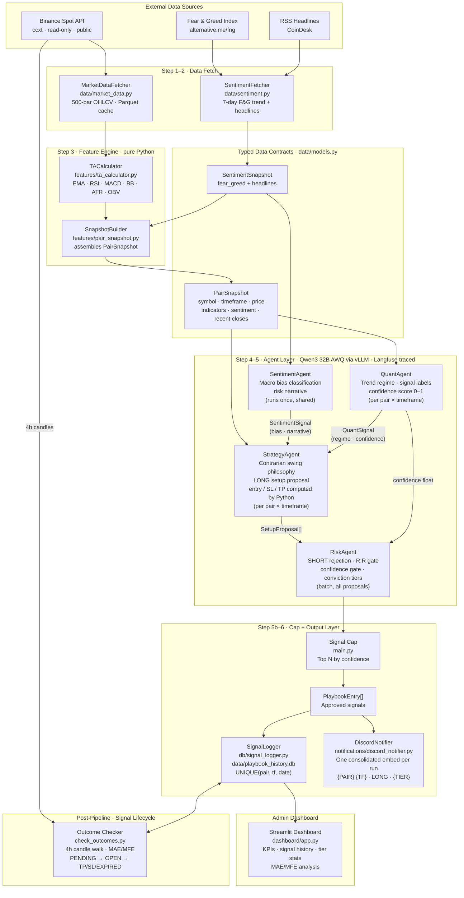

# System Architecture

## Pipeline Overview

The Tenth Floor AI runs a six-step daily pipeline orchestrated by
`main.py`. Data flows from external sources through a pure-Python
feature engine, into a four-agent LLM pipeline, and out to SQLite +
Discord. A separate outcome checker resolves signals post-publication.



---

## Pipeline Steps

### Step 1 — Fetch Market Data

`MarketDataFetcher` fetches 500-bar OHLCV history from Binance for each
pair in `config/universe.json` on the 1d timeframe.
Responses are cached as Parquet files under `data/raw/{SYMBOL}/`.
Subsequent runs do incremental fetches — only new bars since the last
cached timestamp are requested.

### Step 2 — Fetch Sentiment

`SentimentFetcher` retrieves the Fear & Greed Index (7-day history) and
CoinDesk RSS headlines. This runs once per daily pipeline and produces
an immutable `SentimentSnapshot` shared across all pairs. Both sources
degrade gracefully — API failures return safe defaults (F&G = 50, no
headlines).

### Step 3 — Build Snapshots

`TACalculator` computes 13 technical indicators from the OHLCV
DataFrame. `SnapshotBuilder` assembles a typed `PairSnapshot` for each
pair × timeframe, attaching indicators, the latest price, 20 recent
closes/volumes, and the shared `SentimentSnapshot`.

### Step 4 — Agent Pipeline (per snapshot)

Each `PairSnapshot` flows through:

1. **QuantAgent** — classifies trend regime (5 levels), identifies
   signal labels from 13 predefined patterns, scores confidence 0–1
   from indicator consensus.
2. **SentimentAgent** — runs once (not per snapshot). Classifies macro
   bias on a 5-level scale from extreme fear to extreme greed, writes
   a risk narrative for LONG traders.
3. **StrategyAgent** — receives `PairSnapshot` + `QuantSignal` +
   `SentimentSignal`. Python computes entry zone, SL, TP before the
   LLM call. The LLM decides LONG or SKIP and writes the rationale.
   SHORT proposals are hardcoded to SKIP at runtime.

### Step 5 — Risk Gating

`RiskAgent` receives all `SetupProposal` objects with their confidence
scores. It applies deterministic Python rules:

- Reject SHORT direction
- Reject SKIP / HOLD action
- Reject R:R below configured minimum (2.0)
- Reject confidence < configured minimum (0.57 validation, 0.65 production)
- Assign conviction tier: `high` (>= 0.80, 2% risk) or `standard`
  (>= 0.57, 1% risk)

A thin LLM layer generates brief verdict reasoning for each entry.

### Step 5b — Signal Capping

The pipeline enforces a daily signal cap (`max_daily_signals` from
config). Approved signals are sorted by confidence and only the top N
are published. This prevents overloading subscribers with too many
setups.

### Step 6 — Persist and Notify

Approved signals are inserted into SQLite via `SignalLogger` (used as
a context manager) and posted to Discord via `DiscordNotifier` as a
single consolidated embed. The embed field name includes the timeframe:
`SOLUSDT 1D · LONG · STANDARD`. Zero-signal days always post a "No
actionable setups today" message — the channel never goes silent.

The `UNIQUE(pair, timeframe, report_date)` constraint in the schema
prevents duplicate signals if the pipeline runs twice on the same day.
`INSERT OR IGNORE` silently skips duplicates.

Each signal's `langfuse_trace_id` is recorded in the DB, linking it
back to the Langfuse trace for the pipeline run that produced it.

### Post-Pipeline — Outcome Checking

`check_outcomes.py` is a standalone script (run manually or via cron).
It walks 4h candles chronologically for each PENDING/OPEN signal:

- **PENDING → OPEN**: candle low <= entry_high (price entered zone)
- **OPEN → HIT_TP**: candle high >= take_profit
- **OPEN → HIT_SL**: candle low <= stop_loss (SL-first on ambiguity)
- **PENDING/OPEN → EXPIRED**: 14 calendar days with no resolution

MAE (max adverse excursion) and MFE (max favourable excursion) are
tracked per signal during the walk.

---

## Module Reference

### `src/crypto_swing_copilot/`

| File | Responsibility |
|---|---|
| `main.py` | Daily pipeline orchestrator. CLI entry point. Wires Steps 1–6. Per-pair dedup. Langfuse `@observe` traced. |
| `config.py` | Central path resolver. Locates project root via `pyproject.toml`. Exports `PROJECT_ROOT`, `CONFIG_DIR`, `DATA_DIR`. |
| `data/models.py` | All Pydantic v2 contracts. Single source of truth for every inter-module boundary. Frozen models — no mutation after construction. |
| `data/market_data.py` | Binance OHLCV via ccxt (public, no API key). Incremental Parquet cache. Symbol normalisation via `_normalise_symbol()`. |
| `data/sentiment.py` | Fear & Greed Index + RSS headlines via feedparser. Returns `SentimentSnapshot`. Graceful degradation on failure. |
| `features/ta_calculator.py` | Computes EMA-20/50/200, RSI-14, MACD, Bollinger Bands, ATR-14, OBV, Volume-SMA-20 via pandas-ta. Returns `TAIndicators`. |
| `features/pair_snapshot.py` | Assembles `PairSnapshot` from OHLCV + TA + sentiment. Bridge between data/feature layer and agents. |
| `agents/base.py` | `call_llm()` (provider-agnostic, Langfuse-traced), `parse_json_response()`, `clean_json_response()`, config loaders. |
| `agents/quant_agent.py` | Trend regime classification + confidence scoring from indicator consensus. |
| `agents/sentiment_agent.py` | Macro sentiment bias + risk narrative from `SentimentSnapshot`. |
| `agents/strategy_agent.py` | LONG setup proposals. Contrarian swing philosophy. Price levels computed symmetrically from entry midpoint by Python; LLM decides entry or skip. |
| `agents/risk_agent.py` | Final gatekeeper. Deterministic rejection rules (SHORT, R:R, confidence) + conviction tier assignment + LLM verdict reasoning. |
| `db/signal_logger.py` | SQLite persistence with context manager. `log()` (INSERT OR IGNORE), `open_signal_count()`, `get_active_signals()`, `update_signal()` with column whitelist. |
| `dashboard/app.py` | Streamlit admin dashboard. KPIs, signal history table (filterable), performance by conviction tier, outcome distribution, MAE/MFE analysis. |
| `dashboard/queries.py` | Pure SQL + pandas queries for the dashboard. No Streamlit dependency — testable independently. |
| `notifications/discord_notifier.py` | Discord webhook poster. One consolidated embed per run. DB-unaware — receives `open_count` from caller. |
| `check_outcomes.py` | Standalone candle-walk script. PENDING→OPEN→HIT_TP/HIT_SL/EXPIRED. MAE/MFE tracking. 14-day expiry. |

### `config/`

| File | Purpose |
|---|---|
| `universe.json` | 26 Binance USDT spot pairs + sector mapping |
| `risk_profile.json` | Conviction tiers, SL ATR multiplier (1.2), TP R:R ratio (2.0), confidence threshold (0.57/0.65) |
| `models.yaml` | LLM provider, base URL, model name, temperature + max tokens per agent |
| `services.yaml` | ccxt settings, sentiment API URLs, Langfuse config, DB path |
| `profiles/` | validation.json / production.json config overlays |

### `db/`

| File | Purpose |
|---|---|
| `schema.sql` | SQLite DDL for the `signals` table with `UNIQUE(pair, timeframe, report_date)`. Applied at runtime via `CREATE TABLE IF NOT EXISTS`. Version-controlled; the `.db` file is git-ignored. |

---

## LLM Backend

The LLM backend is provider-agnostic. `call_llm()` in `base.py` routes
to any OpenAI-compatible API. The current default is **Qwen3 32B AWQ**
served locally via **vLLM** on an RTX 3090.

```yaml
# config/models.yaml
defaults:
  provider: openai
  base_url: http://localhost:8000/v1
  model: Qwen/Qwen3.5-27B
```

Per-agent overrides control temperature and token budget:

| Agent | Temperature | Max tokens | Rationale |
|---|---|---|---|
| QuantAgent | 0.1 | 512 | Deterministic regime classification |
| SentimentAgent | 0.3 | 512 | Slightly creative narrative |
| StrategyAgent | 0.1 | 512 | Consistent structured JSON (~200 token output) |
| RiskAgent | 0.0 | 512 | Strict rule application |

The `LLM_BASE_URL` env var overrides `base_url` for deployment
flexibility. `clean_json_response()` handles Qwen3-specific artifacts
(`<think>` blocks) and markdown code fences before JSON parsing.

---

## Key Design Rules

### Python owns all arithmetic

`pandas-ta` computes every indicator. Price levels in `StrategyAgent`
are computed by `_compute_price_levels()` before the LLM is called.
LLMs receive pre-computed numbers and must quote them verbatim — they
never recompute. This is enforced at the prompt level in every agent's
system prompt.

### `PairSnapshot` is the boundary object

Everything upstream of the agents produces or enriches a `PairSnapshot`.
Everything downstream consumes it. No agent imports `market_data.py` or
`ta_calculator.py`. No data module imports agents.

### Symbol normalisation happens once

`MarketDataFetcher._normalise_symbol()` converts any input format to
`BTCUSDT` (no slash, uppercase). All downstream modules — agents, DB
logger, Discord notifier — receive and store symbols in this format.

### Immutable typed contracts

All Pydantic models use `frozen=True`. No mutation after construction.
This enables safe tracing, sharing across agents, and deterministic
replay.

### Graceful degradation

Every external dependency has a fallback path. Sentiment API down →
neutral defaults. Pair fetch fails → log and skip that pair. Discord
webhook unset → warn and continue. The pipeline never crashes on a
single-pair or single-source failure.
