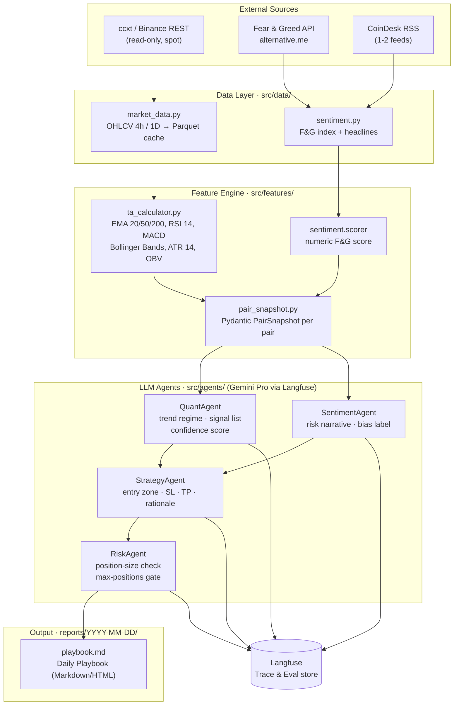

# Crypto Swing Copilot – System Architecture (v1)

## Overview

`crypto-swing-copilot` is a **manual swing-trading research tool**. It fetches OHLCV and
sentiment data for a curated universe of spot crypto pairs, computes technical features
deterministically in Python, then routes enriched context to specialised LLM agents that
produce a prioritised daily playbook. A human trader reviews and executes selectively.

> **Golden rule**: Python computes every number. LLMs only reason and summarise.

---

## Data-Flow Diagram

---

## Module Breakdown

### 1 – Data Layer (`src/data/`)

| Module | Responsibility |
|---|---|
| `market_data.py` | Fetch OHLCV via `ccxt` (Binance, **read-only**). Persist to Parquet under `data/raw/`. Rate-limit aware. |
| `sentiment.py` | Poll Fear & Greed API; parse CoinDesk RSS headlines into plain text. |
| `models.py` | Pydantic models: `OHLCVBar`, `SentimentSnapshot`. |

**Constraints**: no authenticated endpoints, no order placement, no WebSocket streams in v1.

---

### 2 – Feature Engine (`src/features/`)

| Module | Responsibility |
|---|---|
| `ta_calculator.py` | Compute EMA 20/50/200, RSI 14, MACD, Bollinger Bands, ATR 14, OBV using `pandas-ta`. All arithmetic lives here. |
| `pair_snapshot.py` | Assemble `PairSnapshot` Pydantic model per pair – the single typed payload forwarded to every agent. |

**Constraints**: no LLM calls or agent imports inside feature modules; pure data transformation only.

---

### 3 – Agents (`src/agents/`)

Each agent receives a `PairSnapshot` (or aggregated list) and returns a validated Pydantic
response. Every call is traced via Langfuse with inputs, outputs, latency, and token cost.

| Agent | Input | Output Schema |
|---|---|---|
| `QuantAgent` | `PairSnapshot` | `QuantSignal` – trend regime, signal list, confidence |
| `SentimentAgent` | F&G score + headlines | `SentimentSignal` – risk narrative, bias label |
| `StrategyAgent` | `QuantSignal` + `SentimentSignal` | `SetupProposal` – **LONG-only** entry zone, SL, TP, rationale |
| `RiskAgent` | `SetupProposal[]` + portfolio state | `PlaybookEntry[]` – filtered, position-sized, **rejects SHORT** |

**Constraints**:
- Agents receive pre-computed numbers; they **MUST NOT** perform arithmetic.
- **SPOT ONLY**: All agents MUST propose LONG positions only. No shorting.
- `RiskAgent` MUST reject any `SetupProposal` with `direction=SHORT` → verdict `REJECTED`, reason `"Spot only – no shorting"`.
- Positions < `min_position_eur` (€20) MUST be flagged `"Fees too high"` in the playbook.
- See `config/spot_only.json` for the enforcement flag.

---

### 4 – Report (`src/report/`)

| Module | Responsibility |
|---|---|
| `builder.py` | Renders `PlaybookEntry[]` to Markdown (+ optional HTML via Jinja2). |
| `exporter.py` | Writes dated file: `reports/YYYY-MM-DD/playbook.md`. |

---

### 5 – Orchestration (`src/orchestration/`)

| Module | Responsibility |
|---|---|
| `pipeline.py` | Wires all stages; called by the daily CLI entrypoint `run_daily.py`. |
| `run_daily.py` | CLI entrypoint: `python run_daily.py` → emits today's playbook. |

---

## Key Principles

1. **Deterministic math in Python** – `ccxt` + `pandas-ta` own every calculation. LLMs see snapshots, not raw candles.
2. **LLM for reasoning only** – Agents interpret, summarise, and rank. They do not compute RSI, ATR, or position size.
3. **Human-in-the-loop** – The output is a research playbook. Execution is 100% manual.
4. **Typed contracts** – Every inter-module boundary uses a Pydantic model with a JSON schema.
5. **Full observability** – Every LLM call is traced in Langfuse (prompt, response, latency, tokens, cost).
6. **Minimal external dependencies** – v1 uses only Binance spot REST, Fear & Greed API, and 1-2 RSS feeds.
7. **No state mutation** – The system never writes to an exchange. It is strictly read-and-report.
8. **SPOT ONLY / LONG ONLY** – User trades Binance spot. No shorting, no futures, no margin. Every agent prompt must enforce LONG-only.

---

## ⚠️ Spot-Only Implementation Rules

### ✅ DO

- Every agent system prompt MUST include: *"Propose LONG positions only. Spot trading on Binance."*
- `StrategyAgent` MUST set `direction=LONG` on all `SetupProposal` outputs.
- `RiskAgent` MUST reject any setup with `direction=SHORT` → `verdict=REJECTED`, `verdict_reasoning="Spot only – no shorting"`.
- Playbook builder MUST flag positions < `min_position_eur` (€20) with `"⚠️ Fees too high"`.
- Load `config/spot_only.json` → if `only_long=true`, enforce the above.

### ❌ DON'T

- Do NOT generate SHORT `SetupProposal` — even if TA signals bearish, propose SKIP/HOLD, never SHORT.
- Do NOT use futures or margin APIs.
- Do NOT connect ccxt with write/trade API keys.
- Do NOT suggest trades < €20 (fee drag makes them unprofitable on a €100 portfolio).
