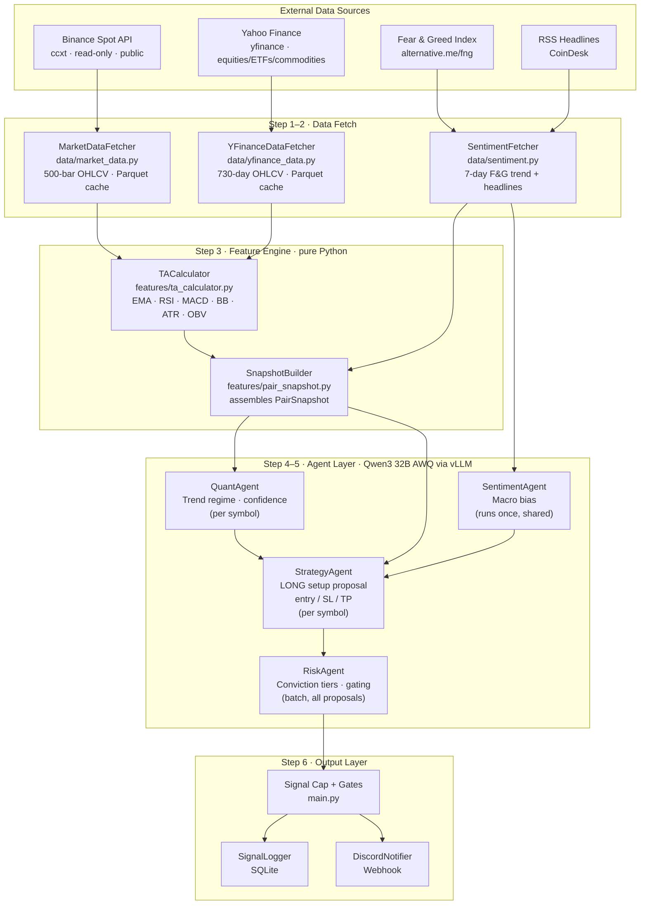

# System Architecture

## Architecture Overview

The Tenth Floor AI is transitioning from V3 (mechanical gates, Python-computed
price levels) to an AI-first architecture (Phase 1.5) where LLM agents make all
trading decisions and Python validates. This document describes both the current
state and the target architecture. See [ROADMAP.md](../ROADMAP.md) Phase 1.5 for
the full implementation plan.

---

## Target Architecture (Phase 1.5: AI-First)

The AI-first pipeline replaces 4 specialised agents + 8 mechanical gates with
3 reasoning agents + a Python validation layer.

**Core principle:** The LLM is the trader. Python is the risk manager.

```
Data (ccxt/yfinance) ──→ TACalculator ──→ Indicators + Structural Levels
                                                   ↓
MacroAnalyst (1 LLM call) ──→ macro frame (regime, per-class impact)
                                                   ↓
Pre-screen (data-quality only) ──→ ~30-36 candidates
                                                   ↓
TradeAnalyst (1 LLM call per candidate) ──→ BUY proposals with entry/SL/TP/reasoning
                                                   ↓
Python validation (sanity checks) ──→ valid proposals
                                                   ↓
RiskReviewer (1 LLM call, ALL proposals) ──→ approved signals with conviction
                                                   ↓
Signal cap (business rule) ──→ featured signals ──→ SignalLogger + Discord
```

### Agents

| Agent | Calls | Role |
|-------|-------|------|
| **MacroAnalyst** | 1 per run | Reads VIX, F&G, DXY. Outputs macro regime + per-asset-class impact. Runs first — its output frames every TradeAnalyst call. |
| **TradeAnalyst** | 1 per candidate | Receives full TA context + macro frame. Decides BUY or SKIP. If BUY: picks entry zone, SL, TP with structural reasoning. Replaces QuantAgent + StrategyAgent. |
| **RiskReviewer** | 1 per run | Sees ALL proposals + macro context + existing open signals. Reviews as a portfolio: correlation, sector concentration, conviction tiers. Replaces RiskAgent + mechanical gates. |

### Python Validation Layer

Runs after all agents. Not a judgment call — a safety net for LLM errors.

| Check | Rule | Why |
|-------|------|-----|
| Direction | No SHORT | Spot only, LONG only |
| Price sanity | SL < entry < TP | Basic math |
| Stop distance | SL not > 15% below entry | Prevents absurd stops |
| Target distance | TP not > 50% above entry | Prevents fantasy targets |
| R:R verification | Recalculate from LLM's numbers, must be >= 1.5 | Business integrity |
| Duplicate check | No open signal for same asset | Prevents double exposure |
| Signal cap | Max 3 featured per day | Business rule |

### Pre-screen

Extremely permissive — saves GPU time, not a quality filter.

Skip only when:
- Fewer than 50 candles of data
- Zero volume for 5+ consecutive days

Everything else goes to TradeAnalyst. The LLM decides quality, not Python.

### What was deleted from V3

| V3 Component | Replacement | Why |
|-------------|-------------|-----|
| QuantAgent | Merged into TradeAnalyst | Trend classification is part of trade analysis |
| StrategyAgent | Merged into TradeAnalyst | One coherent analysis > two fragmented calls |
| SentimentAgent | Replaced by MacroAnalyst | Broader macro context, not just crypto sentiment |
| RiskAgent | Replaced by RiskReviewer | Portfolio-level reasoning, not per-signal rules |
| Gate 1 (trend regime) | TradeAnalyst handles | LLM won't BUY a strong downtrend |
| Gate 3 (volume) | TradeAnalyst sees volume | LLM reasons about it |
| Gate 4 (relative strength) | RiskReviewer handles | Cross-asset comparison |
| Gate 5 (confidence threshold) | TradeAnalyst confidence is real | Not gated by Python |
| Gate 6 (R:R minimum) | Python validation | Verifies math, doesn't set threshold |
| Gate 7 (correlation guard) | RiskReviewer handles | LLM reasons about correlation |
| Gate 8 (sector cap) | RiskReviewer handles | LLM reasons about diversification |
| `_compute_price_levels()` | TradeAnalyst picks levels | LLM uses structural analysis |

---

## Current Architecture (V3/Phase 1 — being replaced)

> **Note:** This section describes the architecture currently running in
> production. Phase 1.5 will replace the agent layer and gates described below.



### V3 Pipeline Steps

1. **Fetch Market Data** — `MarketDataFetcher` (crypto via ccxt) and
   `YFinanceDataFetcher` (equities/ETFs/commodities via yfinance). Both
   use incremental Parquet caching under `data/raw/{SYMBOL}/`.

2. **Fetch Sentiment** — `SentimentFetcher` retrieves F&G Index + RSS
   headlines. Runs once, produces `SentimentSnapshot`.

3. **Build Snapshots** — `TACalculator` computes 13 indicators.
   `SnapshotBuilder` assembles typed `PairSnapshot` per symbol.

4. **Agent Pipeline** — QuantAgent (trend regime), SentimentAgent (macro
   bias), StrategyAgent (LONG proposal with Python-computed levels),
   RiskAgent (conviction tiers + gating).

5. **Gates** — 8 sequential mechanical filters (trend, volume, RS,
   confidence, R:R, sector cap, correlation guard, signal cap).

6. **Persist and Notify** — SQLite via `SignalLogger`, Discord webhook.

---

## Module Reference

### `src/tenth_floor/`

| File | Responsibility |
|---|---|
| `main.py` | Daily pipeline orchestrator. CLI entry point. Langfuse traced. |
| `config.py` | Central path resolver. Locates project root via `pyproject.toml`. |
| `universe.py` | Loads `universe.json`. Asset queries: `symbols()`, `asset_class_for()`, `data_source_for()`, `class_leader_for()`, `sector_map()`. |
| `data/models.py` | Pydantic v2 contracts. Frozen models for every inter-module boundary. |
| `data/market_data.py` | Crypto OHLCV via ccxt. Incremental Parquet cache. |
| `data/yfinance_data.py` | Equity/ETF/commodity OHLCV via yfinance. Incremental Parquet cache. |
| `data/sentiment.py` | F&G Index + RSS headlines. Graceful degradation on failure. |
| `features/ta_calculator.py` | EMA-20/50/200, RSI-14, MACD, BB, ATR-14, OBV, Volume-SMA-20. |
| `features/pair_snapshot.py` | Assembles `PairSnapshot` from OHLCV + TA + sentiment. |
| `agents/base.py` | `call_llm()`, `parse_json_response()`, `clean_json_response()`, config loaders. |
| `db/signal_logger.py` | SQLite persistence. `INSERT OR IGNORE` duplicate safety. |
| `check_outcomes.py` | Signal resolution via candle walk. Routes to ccxt or yfinance per asset class. |
| `dashboard/app.py` | Streamlit admin dashboard. |

### `config/`

| File | Purpose |
|---|---|
| `universe.json` | 36 assets across 4 asset classes + sector mapping |
| `risk_profile.json` | Conviction tiers, R:R floor (1.5), confidence threshold, max signals |
| `models.yaml` | LLM provider, base URL, model name, per-agent temperature + max tokens |
| `services.yaml` | External service URLs, cache settings, DB path |
| `profiles/` | validation.json / production.json config overlays |

---

## LLM Backend

Provider-agnostic via `call_llm()` in `base.py`. Routes to any
OpenAI-compatible API. Default: **Qwen3 32B AWQ** via **vLLM** locally.

```yaml
# config/models.yaml
defaults:
  provider: openai
  base_url: http://localhost:8000/v1
  model: Qwen/Qwen3-32B-AWQ
```

The `LLM_BASE_URL` env var overrides `base_url` for deployment
flexibility. `clean_json_response()` handles Qwen3-specific artifacts
(`<think>` blocks) and markdown code fences before JSON parsing.

---

## Key Design Rules

### AI-first, Python validates

LLM agents make all trading decisions. Python computes indicators as
input context, validates LLM output for sanity (SL < entry < TP, R:R
math, price bounds), and enforces hard business rules (signal cap,
duplicate check, R:R floor).

### `PairSnapshot` is the boundary object

Everything upstream of the agents produces or enriches a `PairSnapshot`.
Everything downstream consumes it. No agent imports `market_data.py` or
`ta_calculator.py`. No data module imports agents.

### Symbol normalisation happens once

Crypto: `BTCUSDT` (no slash, uppercase) via `MarketDataFetcher._normalise_symbol()`.
Equities/ETFs: standard tickers (`AAPL`, `SPY`, `GLD`).
LLM symbol output is overridden with the authoritative snapshot symbol.

### Immutable typed contracts

All Pydantic models use `frozen=True`. No mutation after construction.

### Graceful degradation

Every external dependency has a fallback path. Sentiment API down →
neutral defaults. Symbol fetch fails → log and skip. Discord webhook
unset → warn and continue.
