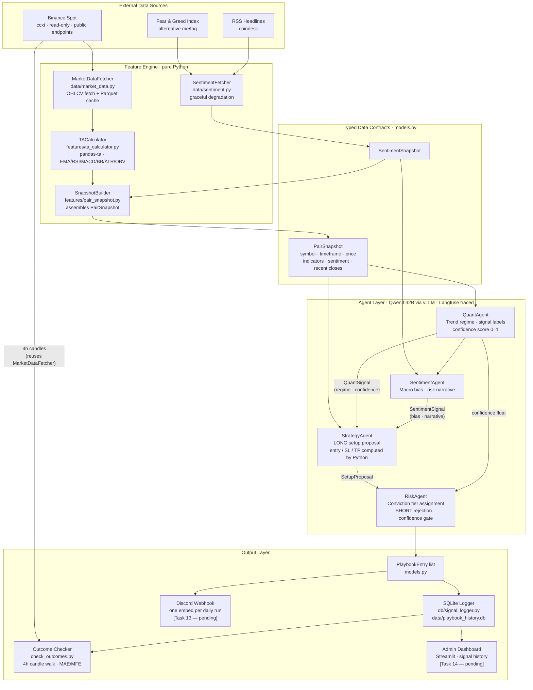

# System Architecture

## Data Flow



---

## Module Reference

### `src/crypto_swing_copilot/`

| File | Responsibility | Key exports |
|---|---|---|
| `config.py` | Central path resolver. Locates project root via `pyproject.toml`. Exports `PROJECT_ROOT`, `CONFIG_DIR`, `DATA_DIR`. | `PROJECT_ROOT`, `CONFIG_DIR`, `DATA_DIR` |
| `data/models.py` | All Pydantic v2 contracts. Single source of truth for every inter-module boundary. Frozen models — no mutation after construction. | `PairSnapshot`, `PlaybookEntry`, `SetupProposal`, `QuantSignal`, `SentimentSignal`, `SentimentSnapshot`, `PlaybookVerdict`, `DailyPlaybook` |
| `data/market_data.py` | Fetches OHLCV from Binance via ccxt (public, no API key). Caches to Parquet under `data/raw/`. Incremental fetch — only new bars are requested. Symbol normalisation via `_normalise_symbol()`. | `MarketDataFetcher` |
| `data/sentiment.py` | Fetches Fear & Greed index (alternative.me) and RSS headlines (feedparser). Returns `SentimentSnapshot`. Both sources degrade gracefully on failure. | `SentimentFetcher` |
| `features/ta_calculator.py` | Computes EMA-20/50/200, RSI-14, MACD, Bollinger Bands, ATR-14, OBV, Volume-SMA-20 from a Pandas DataFrame using pandas-ta. Returns `TAIndicators`. | `TACalculator` |
| `features/pair_snapshot.py` | Assembles `PairSnapshot` from an OHLCV DataFrame + optional `SentimentSnapshot`. Calls `TACalculator` internally. Bridge between data/feature layer and agent layer. | `SnapshotBuilder` |
| `agents/base.py` | Shared agent utilities: `call_llm()` (provider-agnostic, Langfuse-traced), `parse_json_response()`, `clean_json_response()`, `load_agent_config()`, `load_risk_profile()`. Routes to any OpenAI-compatible API (vLLM, Ollama, OpenAI). | `call_llm`, `parse_json_response`, `clean_json_response`, `load_agent_config`, `load_risk_profile` |
| `agents/quant_agent.py` | Classifies trend regime and identifies technical signals. Produces a `confidence` score (0–1) from indicator consensus. | `QuantAgent` |
| `agents/sentiment_agent.py` | Classifies macro sentiment bias and generates a risk narrative from `SentimentSnapshot`. | `SentimentAgent` |
| `agents/strategy_agent.py` | Proposes LONG trade setups. Price levels (entry zone, SL, TP) are computed by Python; LLM decides LONG or SKIP. Hardcoded SHORT rejection. | `StrategyAgent` |
| `agents/risk_agent.py` | Final gatekeeper. Rejects SHORTs, rejects confidence < 0.65, assigns conviction tier (`high`/`standard`), enriches reasoning via LLM. Takes `(SetupProposal, confidence)` tuples. | `RiskAgent` |
| `db/signal_logger.py` | SQLite persistence for approved signals. Applies schema on init, generates signal IDs, manages status updates. Column-whitelist on updates prevents injection. | `SignalLogger` |
| `check_outcomes.py` | Standalone outcome checker. Walks 4h candles chronologically for PENDING/OPEN signals. Detects entry-zone fill, TP/SL hits (SL-first on ambiguity), tracks MAE/MFE, applies 14-day expiry. Groups by pair to minimise fetches. | `check_outcomes`, `_process_signal` |

### `config/`

| File | Purpose |
|---|---|
| `universe.json` | 15 Binance USDT spot pairs to analyse each run |
| `risk_profile.json` | Conviction tiers, SL ATR multiplier, TP R:R ratio, confidence threshold |
| `models.yaml` | LLM provider, base URL, model name, temperature, and max tokens per agent. Global defaults + per-agent overrides. |
| `services.yaml` | CCXT settings, sentiment API URLs, Langfuse config, Discord + DB paths |
| `spot_only.json` | Spot-only enforcement flags (no leverage, no futures, no margin) |

### `db/`

| File | Purpose |
|---|---|
| `schema.sql` | SQLite DDL for the `signals` table. Applied at runtime via `CREATE TABLE IF NOT EXISTS`. Version-controlled; the `.db` file is git-ignored. |

---

## LLM Backend

The LLM backend is provider-agnostic. `call_llm()` in `base.py` routes to any OpenAI-compatible API. The current default is **Qwen3 32B** served locally via **vLLM** on an RTX 5090.

To switch models or providers, edit `config/models.yaml` only — no code changes required.

```yaml
defaults:
  provider: openai                      # any OpenAI-compatible API
  base_url: http://localhost:8000/v1    # vLLM server
  model: qwen3-32b
```

The `LLM_BASE_URL` env var overrides `base_url` for deployment flexibility.

`clean_json_response()` handles Qwen3-specific output artifacts (`<think>` reasoning blocks) and common LLM quirks (markdown code fences) before JSON parsing.

---

## Key Design Rules

### Python owns all arithmetic

`pandas-ta` computes every indicator. LLMs receive pre-computed numbers and must quote them verbatim — they never recompute. This is enforced at the prompt level in every agent's `_SYSTEM_PROMPT`.

Price levels in `StrategyAgent` are computed by `_compute_price_levels()` before the LLM is called. The LLM receives them in the prompt and is instructed to use them exactly.

### `PairSnapshot` is the boundary object

Everything upstream of the agents produces or enriches a `PairSnapshot`. Everything downstream consumes it. No agent imports `market_data.py` or `ta_calculator.py`. No data module imports agents.

### Symbol normalisation happens once

`MarketDataFetcher._normalise_symbol()` converts any input format to `BTCUSDT` (no slash, uppercase). All downstream modules — agents, DB logger, Discord notifier — receive and store symbols in this format. This is a hard contract.

---

## Pending Tasks

| Task | Description | Blocked by |
|---|---|---|
| Task 13 | Discord webhook notifier — posts the daily consolidated embed | — |
| Task 14 | Admin Streamlit dashboard — signal history, outcome tracking | — |
| Orchestrator | `main.py` — wires the full pipeline end-to-end | Task 13 |
